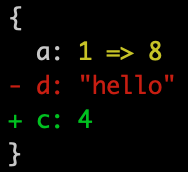

# variable-diff
Visual diff between 2 javascript variables. Shows only the difference and ignores keys that are the same. Diff is formatted in an easy to read format.

[](https://travis-ci.org/taylorhakes/variable-diff)

## Use
```
npm install variable-diff
```

```js
var diff = require('variable-diff');

var defaultOptions = {
  indent: '  ',
  newLine: '\n',
  wrap: function wrap(type, text) {
    return chalk[typeColors[type]](text);
  },
  color: true
};

var result = diff({ a: 1, b: 2, d: 'hello' }, { a: 8, b: 2, c: 4}, defaultOptions);
console.log(result.text);
```


### Test
```
npm test
```
